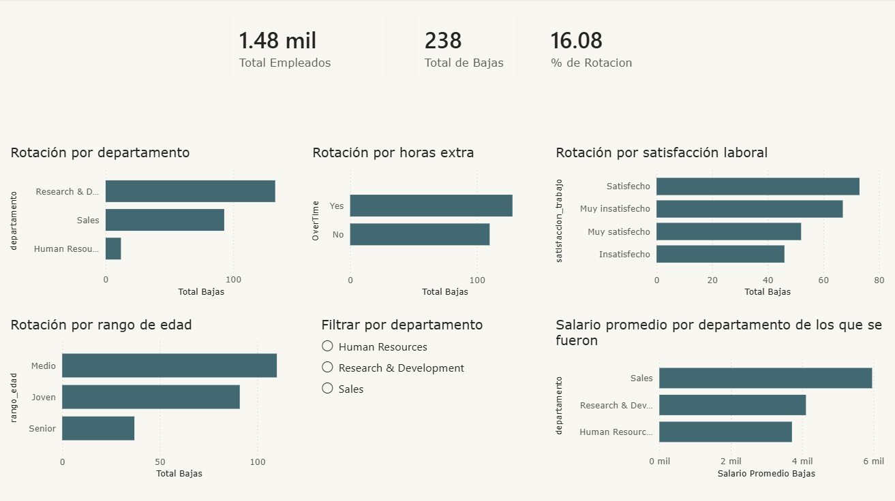
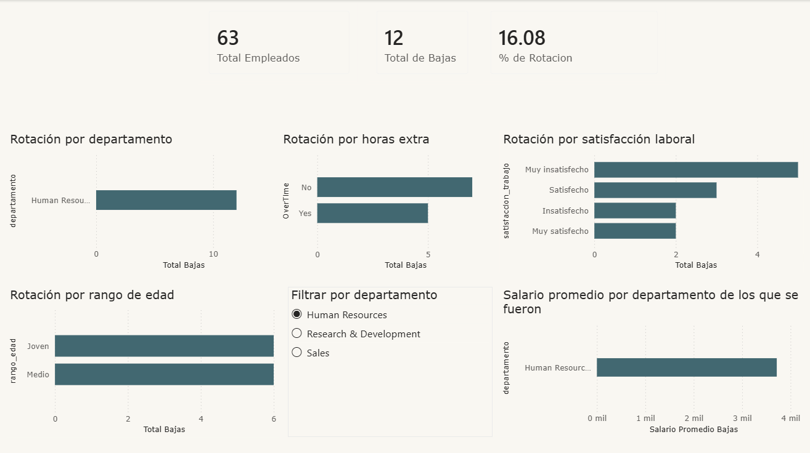
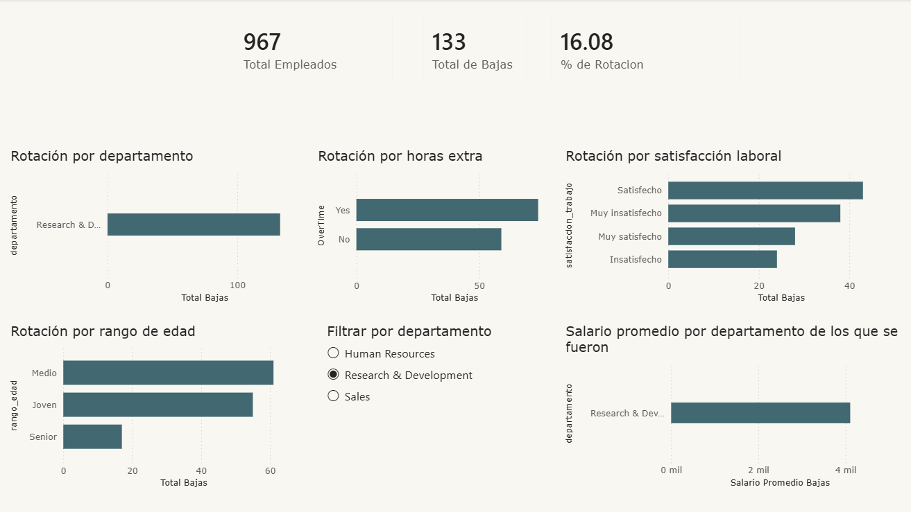
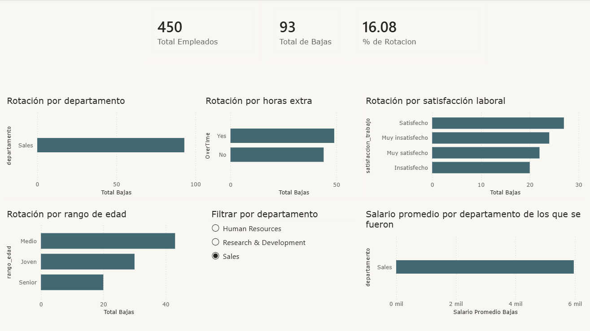

# Análisis de Rotación de Empleados — HR Analytics

Análisis completo de los factores que influyen en la rotación de empleados, usando SQL para el análisis de datos y Power BI para la visualización.


##  Herramientas usadas

- **MySQL** — almacenamiento y consulta de datos
- **DBeaver** — entorno de trabajo para SQL
- **Power BI** — dashboard


##  Estructura de carpeta

```
hr-analytics/
      dashboard/
            HR_Analytics_dashboard.pbix
      imagenes/
            dashboard-general.png (imagen general del dashboard)
            dashboard-HR.png (imagen general del dashboard con departamento Human Resources seleccionado)
            dashboard-R&D.png (imagen general del dashboard con departamento Research & Development seleccionado)
            dashboard-Sales.png (imagen general del dashboard con departamento Sales seleccionado)
      SQL/
            analisis_hr.sql (exploración y analisis completo)
      documentación-hr_analitycs.md (breve documentación hecha para guiarme)
      HR_Analytics.csv (dataset original)
```


##  Objetivo

Identificar los principales factores que generan rotación de empleados en una empresa, respondiendo preguntas concretas de negocio que permitan tomar decisiones de retención.


##  Proceso de trabajo

1. **Exploración**: entender las columnas, valores únicos y distribución de los datos
2. **Verificación de nulos**: confirmar que los datos están completos
3. **Creación de vista**: cree un "view" para trabajar con los datos en español
4. **Análisis SQL**: queries avanzadas con CTEs, window functions y agregaciones
5. **Dashboard Power BI**: visualización interactiva con medidas DAX creadas


##  Preguntas de negocio respondidas

1. ¿Qué departamento tiene mayor rotación?
2. ¿El overtime aumenta la rotación?
3. ¿Los empleados que se van ganan menos?
4. ¿Qué rango de edad tiene más rotación?
5. ¿La satisfacción laboral influye en la rotación?
6. ¿Cuál es el perfil del empleado que más rota?
7. ¿Qué puesto dentro de cada departamento tiene más rotación?
8. ¿Qué empleados ganan más que el promedio de su departamento?


##  Conclusiones principales

- **Sales** es el departamento con mayor porcentaje de rotación (20.7%), seguido por **Human Resources** (19%) y **Research & Development** (13.8%)
- El **overtime** es el factor más determinante: los empleados con horas extra rotan al **30.6%** vs **10.4%** sin overtime — triple de rotación
- El salario **no es el único factor** de rotación. Sales tiene el salario más alto pero también alta rotación, mientras que HR con menor salario muestra una rotación similar
- Los empleados **jóvenes** (menores de 30 años) son los que más rotan, seguidos por el rango medio (30-44) y por último los seniors (44+)
- La **satisfacción laboral** influye: los muy insatisfechos tienen un 22.9% de rotación vs 11.3% de los muy satisfechos
- El **perfil con mayor riesgo** de rotación es el empleado de Research & Development que realiza overtime, independientemente de su rango de edad
- Los puestos con mayor rotación por departamento son: **Sales Representative** en Sales, **Laboratory Technician** en R&D y **HR** en Human Resources

  Las **Columnas** de la db están en negrita


## 📊 Dashboard






